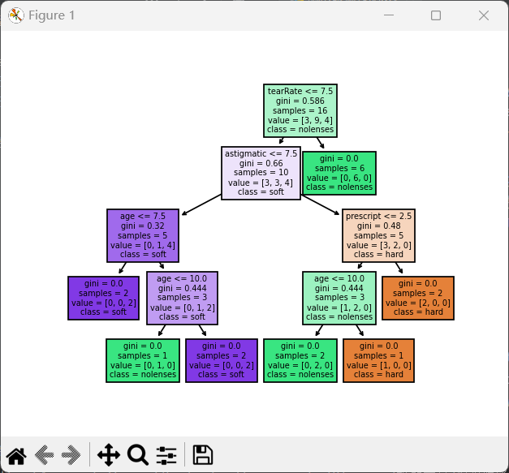

# Decision Tree

## Introduction:

​			决策树(Decision Tree）是在已知各种情况发生概率的[基础](https://baike.baidu.com/item/基础/32794?fromModule=lemma_inlink)上，通过构成决策树来求取净现值的[期望](https://baike.baidu.com/item/期望/35704?fromModule=lemma_inlink)值大于等于零的概率，评价项目风险，判断其可行性的决策分析方法，是直观运用概率分析的一种图解法。由于这种决策分支画成图形很像一棵树的枝干，故称决策树。在机器学习中，决策树是一个预测模型，他代表的是对象属性与对象值之间的一种映射关系。Entropy = 系统的凌乱程度，使用算法[ID3](https://baike.baidu.com/item/ID3?fromModule=lemma_inlink), [C4.5](https://baike.baidu.com/item/C4.5?fromModule=lemma_inlink)和C5.0生成树算法使用熵。这一度量是基于信息学理论中熵的概念。

## Derivation：

### 		Amount Of Information:

​				信息量在很长的一段时间内，我感觉这是一个很混沌的量，在脑海里对他的印象若即若离，不可琢磨，直到最近我才想到了一个好的方法尝试取理解它，就是在某一个事件发生的概率下，这个事件可能发生的情况的多少。Emmm...可能解释的不是很清楚，不妨来举个例子说明一下我的想法。就比如说明天早上太阳在东边升起，西边落下。那么关于这个事件，它发生的可能性是一定的，当然也有可能今天晚上宇宙爆炸，这说不好，但是我们不考虑这种情况的发生。太阳东升西落这个就是明天一定要发生的没有其他的可能性而言，他的信息量就是0，因为它不包含其它可能发生的事情。再来看一个例子，比如，我明天去钓鱼。那么关于我去钓鱼这个事情，他可能发生，也可能不发生，当然不发生的概率是很大的，那么我不去钓鱼去干什么？可能去爬山，看电影，约会等等，这个有非常多的可能，由此可见在关于这一个事件的预测下，包含了很多的其它事情，所以他的信息量的非常大的，这个量就是我认为的，可能发生的事件数量。这里我们给出信息量的计算公式：

$$
Info=-log_2(p_k)
$$


### Entropy：

​				熵这个概念第一次接触的时候是在上高中化学课的时，他表示的是在反应过程中某个体系的混乱程度。在信息熵中，他也是表示的是一种混乱程度。其实这个，我个人也做过一些更深刻的思考，这个所谓的混乱，其实是相对于我们观察来说的，就像如果我们把一把红豆和一把绿豆放在一个碗里面，自然而然的红豆和绿豆他们会趋向于变得混在一起而不是分层。在我们看来红豆绿豆分层的话，这个是均匀的，但是如果我们以一整个自然体系来看，均匀不正是应该每一个地方有红豆和绿豆的概率是一样的嘛？这和我们认为的均匀是相悖的，但是没关系，只是我的一个小小的思考。我们这里的信息熵，表示的是信息的混乱程度。其实就是相对于某一个事件发生的所有可能性的对于每一种可能性的信息量的加权平均数，所谓信息量，我个人感觉他表示的就是一种混乱程度，但是他是相对于某一种可能性的，而相对于事件，就把每一种可能性的混乱程度加权平均，这很容易理解，这里我们也给出他的计算公式：

$$
Ent(D)=-ΣP_klog_2(P_k)
$$


### 		Attribute division：

​				

#### 							Entropy Gain(ID3):

​				在ID3决策树中，属性的划分方法采用的是信息增益的方法，信息增益很好理解。首先这个增益坑定是针对某一个事件的，不可能针对的是某一个事件中的某一种可能性。那么既然是针对于某一个事件的，坑定要用两个信息熵的差来计算这个增益，毫无疑问的，坑定是某一个事件之前有一个信息熵，然后经过处理之后，又有一个信息熵。这两个信息熵的差就是我们所谓的信息增益。那么对于我们的西瓜来说，这个事件有两种发生的可能性，要么是好瓜，要么是坏瓜。这个时候我们拿到一个数据集，我们可以很容易的计算出这批西瓜里面好瓜的概率和坏瓜的概率，争对西瓜是好还是坏，我们找到了他的每一种可能性发生的概率，根据前面的信息熵的公式，我们不难算出没有划分之前的西瓜好坏的信息熵，然后我们根据数据集中西瓜的每一种属性来划分数据集，划分后，我们依然可以得到每一个划分后的数据集的信息熵，然后我们把每一个数据集的信息熵加起来，当然这里的相加是加权的一个相加，加起来之后，我们就能得到划分后数据集的信息熵，我们把这两个信息熵相减，得到一个信息增益，就这样计算出按照每一个属性划分的信息增益，我们选取信息增益最大的作为我们的划分依据，因为，信息增益大了，混乱程度减小的就多了嘛，这很容易理解。之后我们在计算划分后每一个数据集的每一个属性的信息增益，得到最佳属性，直到最后没有属性可以划分，或者已经信息增益为0了。由此我们可以得出信息增益的计算公式：

$$
EntropyGain(X,x_i)=Entropy(X)-Σ\frac{x_i}{X}Entropy(x_i)
$$


#### 							Gain_Ratio(C4.5):

​				在C4.5决策树中，采用信息增益率来作为划分的依据。这个主要是为了解决ID3决策树对于可取值数目较多的属性有 所偏好,或者偏好于某个属性的每个取值的样本数 非常少的情况。就比如我们把它的编号x<sub>1</sub>作为一个划分的依据，那么

$$
Entropy(x_1)=Σ\frac{x_1}{X}Entropy(x_i)=n*(\frac{1}{n}(-log_21))=0
$$

很显然这个时候信息增益是最大的，因此为了解决这一冲突，我们在信息增益的基础上，让它除以一个相对的数字，来遏制这种结果，我们希望这个数字随着某一个事件可以发生可能性的变多而增大，这个数字就是IV，他的计算方式和信息熵的计算方式是差不多的，我们将某一个属性作为一个事件，这个属性的取值作为事件发生的可能性，计算这个属性的信息熵，就是IV了，来看它的计算公式：

$$
IV(A,a_i)=-Σ\frac{a_i}{A}log_2\frac{a_i}{A}
$$

这里的‘A’表示在该属性下所有的可能性的数量，a<sub>i</sub>表示属性a<sub>i</sub>的数量然后信息增益率就是：

$$
Gain_Ratio(X,x_i)=\frac{EntropyGain(X,x_i)}{IV(x_i,x_{ij})}
$$


#### 							Gini(C5.0):

​				在C5.0决策树中，划分属性采用基尼系数，这个其实就是按照信息熵来划分的，我们直接来看公式：

信息熵的公式：

$$
Ent(D)=-ΣP_klog_2(P_k)
$$

基尼系数的公式：

$$
Gini(D)=-ΣP_K*(1-P_k)=1-Σ(P_k)^2
$$

1- x是- log2 x的近似，实际上是后者的泰勒展开的一阶近似。 所以，基尼值实际上是信息熵的近似值。然后其它的和信息增益的步骤是一样的：

$$
GiniIndex(X,x_i)=-Σ\frac{x_i}{X}Gini(x_i)
$$


### 		Prune：

​			为了避免过拟合，我们需要对决策树进行剪枝处理，这里有预剪枝（Want To Prune）和后剪枝（Post Prune）两种方法

#### 							Want To Prune:

​			预剪枝，从名字就可以看出来，是先进行剪枝，在生成决策树，但是，我们连决策树都没有，怎么剪枝？那就是在决策树生成的过程中进行剪枝喽！假设现在我们要考虑一个结点该不该划分，那我们应该有一个度量的指标来确定这个结点该不该划分。这个指标用来对比划分前后决策树的好坏，那么判断一个决策树的好坏，自然而然的就想到‘精度’这个量：

$$
Acc(X,Y)=\frac{Σ(f(x_i)==y_i)}{N}
$$

既然要对比前后，那么坑定不能只在一个数据集上进行操作，所以这里就需要将数据集划分为训练集和测试集，在划分某一个结点的时候，考虑划分前后，决策树在测试集上的精度是否增加。

#### 							Post Prune:

​			在预剪枝生成的决策树中，可以降低过拟合风险，显著减少训练时间和测试时间开销，但是，有些分支的当前划分虽然不能提升 泛化性能，但在其基础上进行的后续划分却有可 能导致性能显著提高。预剪枝基于“贪心”本质 禁止这些分支展开，带来了欠拟合风险，由此为了避免预剪枝带来的欠拟合风险，我们可以采用后剪枝的方法，也就是先生成一颗决策树，再来对其结点进行评估，决定其是否去留。依然采用精度作为评估的依据，进行自底而上的剪枝操作。


### 		Data Processing:


#### 						Continuous Value Processing:

​			在构建决策树的时候我们拿到的数据集的属性一般情况下都是一些离散的值就像西瓜数据集中的根蒂，颜色等等，但是，不乏有一些数据集也会有着一些连续的值，比如西瓜的甜度，含糖率等等，这些连续的值，他们很少存在说几个值相同的情况，那么如果按照这一个属性划分的话，我们得到的结果将会很惨淡，很大几率会让我们的决策树过拟合，所以我们需要对这一个连续的值进行处理。这里我们了解到了二分法。

​			二分，顾名思义，是将这个连续值的属性分为两个类别，那么最直观的方法就是我们找到这些连续值中间的某一个值T，让属性中大于T的为A类，小于等于T的为另一类。假设我们现在有一个属性值为连续值的属性X，那么我们就需要找到这样的一个值T：

$$
f(X_i)=\begin{cases} 
		1, & X_i>T\\ 
		0, & X_i<=T
\end{cases}
$$

那么该如何找到这个值呢？其实很简单，我们将属性X中所有的属性值按照从小到大的顺序进行排练，然后用X<sub>i+1</sub>-X<sub>i</sub>,得到一个拥有Length(X)-1的集合，我们让这个集合为A，A中的元素为A<sub>i</sub>,我们让T的值一个一个的去等于A<sub>i</sub>,这样呢，我们就能得到Length（X）-1种划分的方法，来将这个连续值的属性划分为两类。下面我们要进行的就是要从这些类中找到一个最合适的划分方法，那么这个就和前面的属性划分方法差不多了，就是计算他的熵增，选取一个能使熵增最大的A<sub>i</sub>,让它等于T，这样就得到了我们期望得到的值。这里我们给出他的计算公式：

$$
T=max(EntropyGain(X,A,A_i))=max[Entropy(X)-Σ\frac{Σf(A_i)}{A}*Entropy(Σf(A_i))]
$$


#### 						Missing Value Handling:

#### End：

#### 		Data：


#### Analysis:




首先我们来看一下这个结果图，这个结果是用决策树里面自带的函数做出来的。每一个里面有五个或者四个参数。我们来看一下这些参数，分别代表什么。

##### gini：

​		这个参数值就是，根据当前特征划分后的数据集的基尼指数值。当然了，这个也可以是信息熵。

##### samples：

​		这个参数就是值，在当前划分下样本的个数。

##### value：

​		这个是一个列表的形式，它每一个元素表示的是对应label的元素个数。比如说我们这个数据集的label有三个：

$$
label=[hart,nolenssen,sort]
$$

那么比如说这个：

$$
[1,2,3]
$$

它表示的是，当前hart标签的样本有一个，nolenssen样本的个数有2个，sort样本的个数有三个。

##### class:

​		这个很简单，就是表示如果一个样本落到了当前的节点，那么它所属于的类别。

##### else:

​		其它的，也就是我们有的有有的没有的那个，这个表示的就是当前是按照哪个特征进行划分的。


#### Code:

​			这次实验的代码，是采用了sklearn模型下的方法的，因为我上次写的那个只考虑了label有两个属性的情况，到了这个就不太适用了。当时没有考虑这么多。然后的话，再写一次就有点复杂了，而且又浪费时间。所以就直接用函数了。下面我们先来介绍一下主要的函数，以及参数。

##### Reference：

###### sklearn.tree.DecisionTreeClassifier（）：

​		首先我们来介绍这个函数，这个是我们使用的一个主要的函数。当然实际上它是一个类。这个类需要传入大致有12个参数。其中有7个是最常用的，我们就来介绍一下这七个函数就好。

​		首先第一个参数Criterion。这个参数是决定我们要用什么方法来划分结点的，我们上面提到了三种方法。但是这里的参数选择只有两种，一种是gini指数的形式，另一种是eptorpy。前者指的是用基尼指数划分，而后者是用信息熵来划分。

​		接着就是两个和随机相关的参数（random_state，splitter）。random_state就是设计随机数种子的。这个参数默认为空，也就是不设计随机数种子，那么每一次画出来的决策树都不一样。我是习惯设置一个的，但是其实对于小样本来说，设计和不设计都无所谓。另一个splitter这个参数也是有两个选项，一个是best一个是random。这个参数是在有特征的决策值相同的时候用的，选择best它会根据特征的重要程度来选择，而选择random就是随机的了。

​		然后我们来介绍四个和剪枝相关的参数（max_depth, ，min_sample_leaf，max_feature，min_impurity_decrease）max_depth,这个很好理解，就是我们创建的决策树的最大深度，限制这个应该是最直观的一种限制过拟合的方法了。与他对应的还有一个max_leaf_nodes，这个限制最多有几个叶子结点，也是为了过拟合和限制树的深度原理基本一致。接下来，min_sample_leaf，这个也很简单。就是当前划分结点下面，还有几个样本。如果样本数多于min_sample_leaf的值就继续划分，否则就不划分了。max_feature，这个是在分支的时候限制考虑的特征个数。比如说我原来有5个特征，现在max_feature=3，那么我每次分支时，从五个里面选择三个特征来比较划分。这个方法一般在高维数据时使用，低微使用，比较容易欠拟合。min_impurity_decrease，这个很容易理解，就是我们的划分指标小于这个值就不继续划分了，也是为了不让模型的过拟合考虑的。

######  train_test_split()：

​	这个函数是用来划分测试集和训练集的，它有四个参数，data，target，testsize，和random_tate。前边的就是我们的数据集和标签，后面的就测试集占整个数据集的比率。最后一个就是随机数种子。

##### Coding：

​	1.1：我们也创建这样的一个类，来实现决策树。并且传入相关的参数，来初始化类。

```python
import random
import numpy as np
from sklearn import tree
import matplotlib.pyplot as plt
from sklearn.model_selection import train_test_split
from sklearn.tree import plot_tree
random.seed(10)
class Decision_Tree:
    ##################################初始化类，传入数据集参数和模式##############################
    def __init__(self,DataSet_Path=r'./lenses.csv',class_weight=None, criterion='gini', max_depth=None,
                       max_features=None, max_leaf_nodes=None,
                       min_impurity_decrease=0.0,
                       min_samples_leaf=1, min_samples_split=2,
                       min_weight_fraction_leaf=0.0,
                       random_state=2, splitter='best',radio=0.3):
        self.DataSet_Path=DataSet_Path     #数据集路径
        self.criterion=criterion		   
        self.class_weight=class_weight
        self.max_depth=max_depth
        self.max_feature=max_features
        self.max_leaf_nods=max_leaf_nodes
        self.min_impurity_decrease=min_impurity_decrease
        self.min_samples_leaf=min_samples_leaf
        self.min_samples_split=min_samples_split
        self.min_weight_fraction_leaf=min_weight_fraction_leaf
        self.random_state=random_state		#随机数种子
        self.splitter=splitter
        self.radio=radio                   #测试集比率
```

​	1.2：然后我们就开始构建数据集，因为它这个输入不能用字符串。所以我们得把字符串转换为数值。然后划分等等操作。我们返回它的数据集，测试机，特征名称，label名称等等。都是后续要用到的一些

```python
    ################################对传入的数据进行处理#######################################
    def Create_DataSet(self):

        self.DataSet=open(self.DataSet_Path).read()
        self.DataSet=self.DataSet.split('\n')
        for i in range(len(self.DataSet)):
            self.DataSet[i]=self.DataSet[i].split(',')
        self.DataSet=self.DataSet[0:len(self.DataSet)-1]
        self.feature_name=self.DataSet[0][0:len(self.DataSet[0])-1]   ##创建特征值名称向量
        del self.DataSet[0]
        self.label_name=sorted(set(np.array(self.DataSet)[:,-1].tolist()))   ##标签的名称创建
        DataSet_f=sorted(list(set([item for value in self.DataSet for item in value])) )##将数据展开成一维张量
        X_sample=self.DataSet[0][0:len(self.DataSet[0])-1]
        debox=[]
        ####将数据转化为int类型##############################################################################
        dictor={}
        count=0
        for item in DataSet_f:
            dictor.update({item:count})
            bebox=[]
            count=count+1
            for value in range(len(np.where(np.array(self.DataSet)==item)[0].tolist())):
                listd = []
                x=np.where(np.array(self.DataSet)==item)[0].tolist()[value]
                y=np.where(np.array(self.DataSet) == item)[1].tolist()[value]
                listd.append(x)
                listd.append(y)
                bebox.append(listd)
            debox.append(bebox)
        count=0

        for item in debox:
            count=count+1
            for value in item:
                self.DataSet[value[0]][value[1]]=count
        ######################################################################################################
        length=len(self.DataSet[0])
        target=np.array(self.DataSet).T.tolist()[-1]
        data=np.array(self.DataSet).T[0:length-1].T.tolist()
        Xtrain, Xtest, Ytrain, Ytest = train_test_split(data, target, test_size=self.radio,random_state=self.random_state)
        self.Xtrain,self.Xtest,self.Ytrain,self.Ytest=Xtrain, Xtest, Ytrain, Ytest
        return Xtrain,Xtest,Ytrain,Ytest,self.feature_name,self.label_name,X_sample,dictor,DataSet_f

```

​	1.3：接下来就是训练模型，这里就是用了tree.DecisionTreeClassifier这个类和fit方法

```python
def Create_Tree(self):
    Xtrain, Xtest, Ytrain, Ytest, feature_name, label_name,_,_,_=Decision_Tree.Create_DataSet(self)
    model=tree.DecisionTreeClassifier(class_weight=self.class_weight, criterion=self.criterion, max_depth=self.max_depth,
                   max_features=self.max_feature, max_leaf_nodes=self.max_leaf_nods,
                   min_impurity_decrease=self.min_impurity_decrease,
                   min_samples_leaf=self.min_samples_leaf, min_samples_split=self.min_samples_split,
                   min_weight_fraction_leaf=self.min_weight_fraction_leaf,
                   random_state=self.random_state, splitter=self.splitter)
    model=model.fit(Xtrain,Ytrain)
    return model,feature_name,label_name
```

​	1.4:接下来就是画图这个函数，用来自带的方法,可以传入画布的长和宽;

```python
def plot(self,width=15,height=9):
    model,feature_name,label_name=Decision_Tree.Create_Tree(self)
    plt.figure(figsize=(width, height))
    plot_tree(model, filled=True, feature_names=feature_name, class_names=label_name)
    plt.show()
```

​	1.5：模型弄出来总要一个得分的，我们这里返回它的得分，也是用了自带的socore方法：

```python
def get_score(self,Xtest=None,Ytest=None):
    _, X, _, Y, _, _,_,_,_=Decision_Tree.Create_DataSet(self)
    model, _, _ = Decision_Tree.Create_Tree(self)
    if Xtest==None:
        Xtest=X
    if Ytest==None:
        Ytest=Y
    score = model.score(Xtest, Ytest)
    print(score)
    return score
```

​	1.6：接下来就是我们怎样使用这个模型。原来的模型要求输入数值，就很麻烦，我们这里写一个函数，让他可以直接输入名称：

```python
def prediect(self,X=None):
    model, _, _ = Decision_Tree.Create_Tree(self)
    _, _, _, _, _, _, X_sample, dictor,NAMES = Decision_Tree.Create_DataSet(self)
    if X==None:
        print("请输入要预测的值,例如（{}）".format([X_sample]))
    else:
        Xl=[]
        for item in X:
            if item in dictor:
                Xl.append(dictor[item])
            else:
                print("数据格式错误,请重新输入，例如（{}）".format([X_sample]))
        print("样本:{},的预测类别是:{}".format(X,[NAMES[model.predict([Xl])[0]-1]]))
        return [NAMES[model.predict([Xl])[0]-1]]
```

​	1.7：看一下输出结果吧：


##### All Code:

```python
import random
import numpy as np
from sklearn import tree
import matplotlib.pyplot as plt
from sklearn.model_selection import train_test_split
from sklearn.tree import plot_tree
random.seed(10)
class Decision_Tree:
    ##################################初始化类，传入数据集参数和模式##############################
    def __init__(self,DataSet_Path=r'./lenses.csv',class_weight=None, criterion='gini', max_depth=None,
                       max_features=None, max_leaf_nodes=None,
                       min_impurity_decrease=0.0,
                       min_samples_leaf=1, min_samples_split=2,
                       min_weight_fraction_leaf=0.0,
                       random_state=2, splitter='best',radio=0.3):
        self.DataSet_Path=DataSet_Path
        self.criterion=criterion
        self.class_weight=class_weight
        self.max_depth=max_depth
        self.max_feature=max_features
        self.max_leaf_nods=max_leaf_nodes
        self.min_impurity_decrease=min_impurity_decrease
        self.min_samples_leaf=min_samples_leaf
        self.min_samples_split=min_samples_split
        self.min_weight_fraction_leaf=min_weight_fraction_leaf
        self.random_state=random_state
        self.splitter=splitter
        self.radio=radio


    ################################对传入的数据进行处理#######################################
    def Create_DataSet(self):

        self.DataSet=open(self.DataSet_Path).read()
        self.DataSet=self.DataSet.split('\n')
        for i in range(len(self.DataSet)):
            self.DataSet[i]=self.DataSet[i].split(',')
        self.DataSet=self.DataSet[0:len(self.DataSet)-1]
        self.feature_name=self.DataSet[0][0:len(self.DataSet[0])-1]   ##创建特征值名称向量
        del self.DataSet[0]
        self.label_name=sorted(set(np.array(self.DataSet)[:,-1].tolist()))   ##标签的名称创建
        DataSet_f=sorted(list(set([item for value in self.DataSet for item in value])) )##将数据展开成一维张量
        X_sample=self.DataSet[0][0:len(self.DataSet[0])-1]
        debox=[]
        ####将数据转化为int类型##############################################################################
        dictor={}
        count=0
        for item in DataSet_f:
            dictor.update({item:count})
            bebox=[]
            count=count+1
            for value in range(len(np.where(np.array(self.DataSet)==item)[0].tolist())):
                listd = []
                x=np.where(np.array(self.DataSet)==item)[0].tolist()[value]
                y=np.where(np.array(self.DataSet) == item)[1].tolist()[value]
                listd.append(x)
                listd.append(y)
                bebox.append(listd)
            debox.append(bebox)
        count=0

        for item in debox:
            count=count+1
            for value in item:
                self.DataSet[value[0]][value[1]]=count
        ######################################################################################################
        length=len(self.DataSet[0])
        target=np.array(self.DataSet).T.tolist()[-1]
        data=np.array(self.DataSet).T[0:length-1].T.tolist()
        Xtrain, Xtest, Ytrain, Ytest = train_test_split(data, target, test_size=self.radio,random_state=self.random_state)
        self.Xtrain,self.Xtest,self.Ytrain,self.Ytest=Xtrain, Xtest, Ytrain, Ytest
        return Xtrain,Xtest,Ytrain,Ytest,self.feature_name,self.label_name,X_sample,dictor,DataSet_f

    def Create_Tree(self):
        Xtrain, Xtest, Ytrain, Ytest, feature_name, label_name,_,_,_=Decision_Tree.Create_DataSet(self)
        model=tree.DecisionTreeClassifier(class_weight=self.class_weight, criterion=self.criterion, max_depth=self.max_depth,
                       max_features=self.max_feature, max_leaf_nodes=self.max_leaf_nods,
                       min_impurity_decrease=self.min_impurity_decrease,
                       min_samples_leaf=self.min_samples_leaf, min_samples_split=self.min_samples_split,
                       min_weight_fraction_leaf=self.min_weight_fraction_leaf,
                       random_state=self.random_state, splitter=self.splitter)
        model=model.fit(Xtrain,Ytrain)
        return model,feature_name,label_name

    def plot(self,width=15,height=9):
        model,feature_name,label_name=Decision_Tree.Create_Tree(self)
        plt.figure(figsize=(width, height))
        plot_tree(model, filled=True, feature_names=feature_name, class_names=label_name)
        plt.show()

    def get_score(self,Xtest=None,Ytest=None):
        _, X, _, Y, _, _,_,_,_=Decision_Tree.Create_DataSet(self)
        model, _, _ = Decision_Tree.Create_Tree(self)
        if Xtest==None:
            Xtest=X
        if Ytest==None:
            Ytest=Y
        score = model.score(Xtest, Ytest)
        print(score)
        return score

    def prediect(self,X=None):
        model, _, _ = Decision_Tree.Create_Tree(self)
        _, _, _, _, _, _, X_sample, dictor,NAMES = Decision_Tree.Create_DataSet(self)
        if X==None:
            print("请输入要预测的值,例如（{}）".format([X_sample]))
        else:
            Xl=[]
            for item in X:
                if item in dictor:
                    Xl.append(dictor[item])
                else:
                    print("数据格式错误,请重新输入，例如（{}）".format([X_sample]))
            print("样本:{},的预测类别是:{}".format(X,[NAMES[model.predict([Xl])[0]-1]]))
            return [NAMES[model.predict([Xl])[0]-1]]

A=Decision_Tree()
A.plot(5,4)
A.get_score()
A.prediect(['young', 'myope', 'yes', 'normal'])
```
